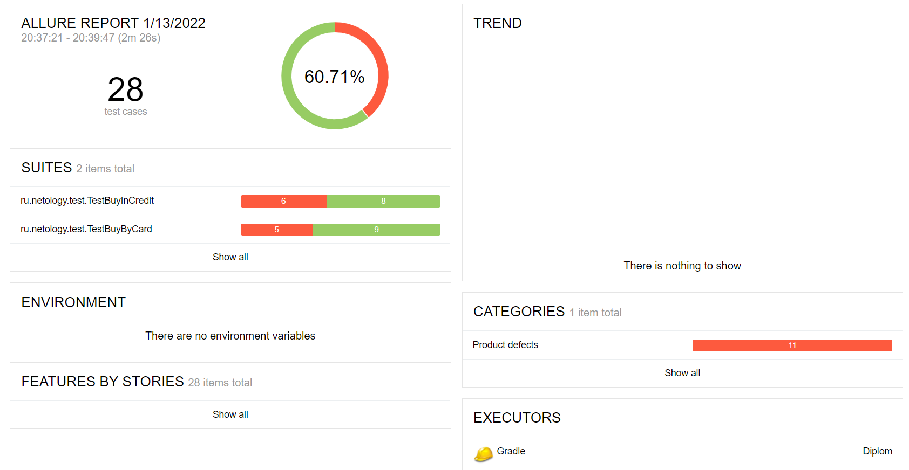

## Отчет по итогам автоматизированного тестирования ##
___
### Краткое описание ###
___
Задачей проекта стало проведение функционального тестирования сервиса покупки тура картой и в кредит.

На первом этапе было проведено исследовательское тестирование с использованием эквивалентных и граничных значений.
Затем написаны автотесты для проверки позитивных и негативных сценариев покупки тура, тестирование UI и БД.

Реализована поддержка двух БД - MySQL и PostgreSQL.

Перед началом автоматизации был разработан [PLAN.md](https://github.com/kokanoka/Diploma/blob/master/PLAN.md)

### Количество тест-кейсов ###
___
Общее количество тест-кейсов: 28

Количество позитивных: 4

Количество негативных: 24

По результатам отчета Allure 60,71% тестов завершились успешно, 39,29% неуспешно.

Выявленные дефекты отражены в [Issues](https://github.com/kokanoka/Diploma/issues).

### Общие рекомендации ###
___
- Устранить обнаруженные дефекты;
- В случае, когда поле остается незаполненным изменить предупреждение с "Неверный формат", на "Поле, обязательное для заполнения";
- Добавить возможность ввода номера банковской карты с длиной от 13 до 19 цифр. Сейчас реализована возможность введения номера карты, длиной 14 цифр;
- Добавить выделение цветом кнопки "Купить" или "Купить в кредит" при переключении между вкладками. 
- Создать документацию для приложения.
